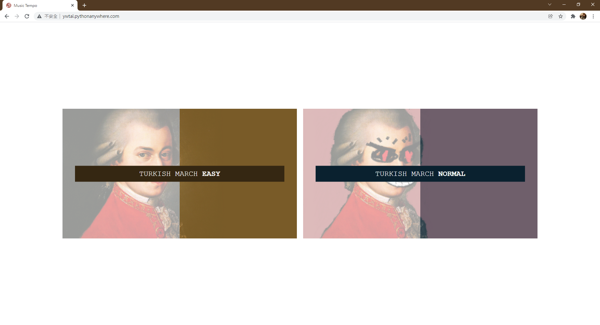
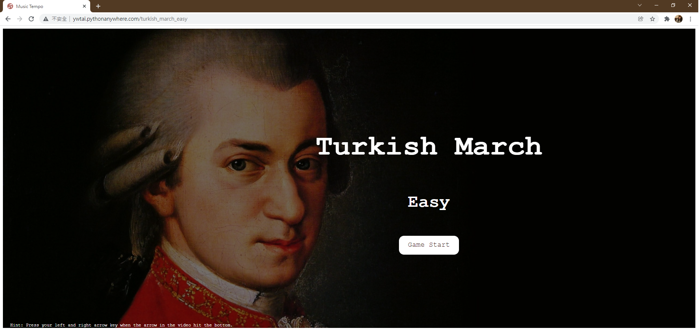
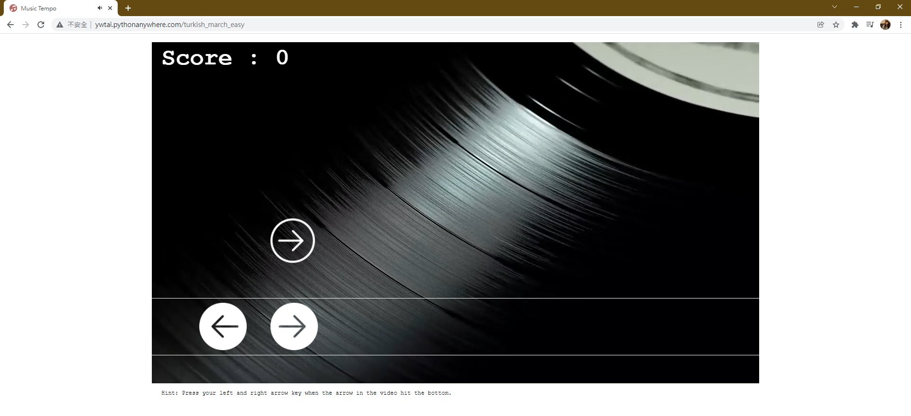
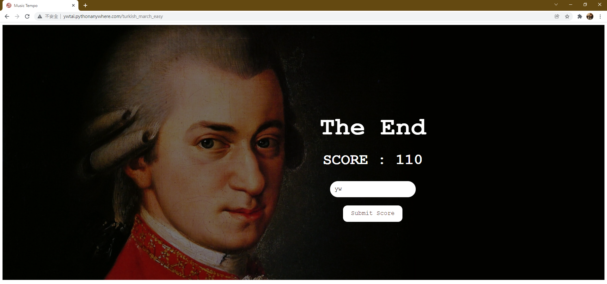
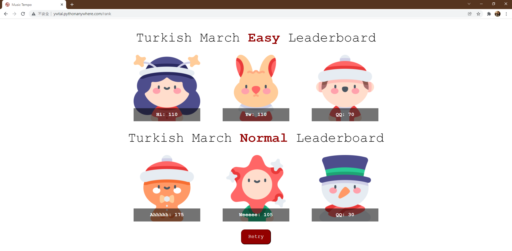

# Classical Music Tempo Game
Mini classical music tempo web game develop with **Flask** and **JavaScript**.

## Instruction
1. Choose the music and difficulty to play  

2. Press "Start Game" and start to play  

3. Press your left and right arrow when the arrow key in the video hit the bottom  

4. Enter your name and summit your score  

5. Compete with others!  

 

[Give it a try!](http://ywtai.pythonanywhere.com/)

## Roadmap
- [x] Let player insert their name and show rank
- [ ] Add different diffculties
    - [x] Easy
    - [x] Normal
    - [ ] Hard
- [ ] Add different music
- [ ] Optimize timing of the game
- [ ] Optmizie style and display

